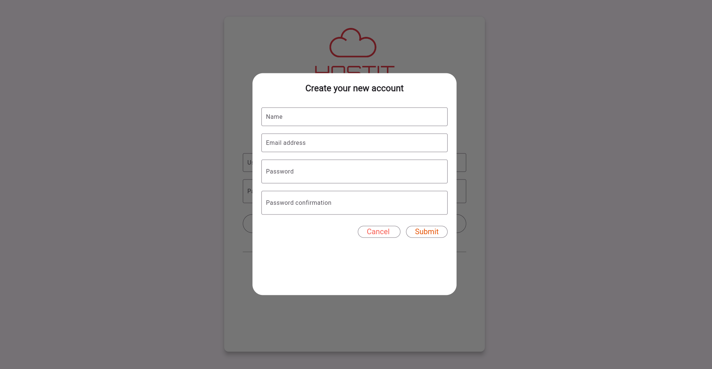
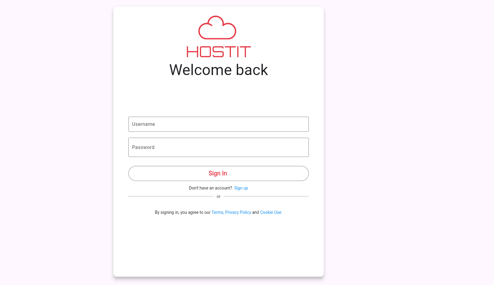
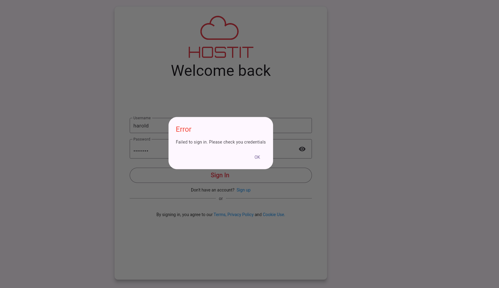
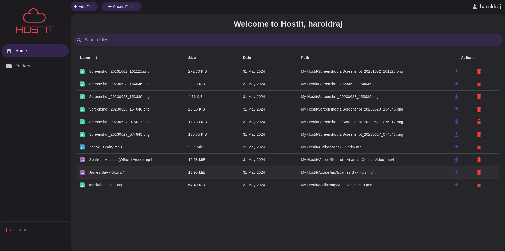
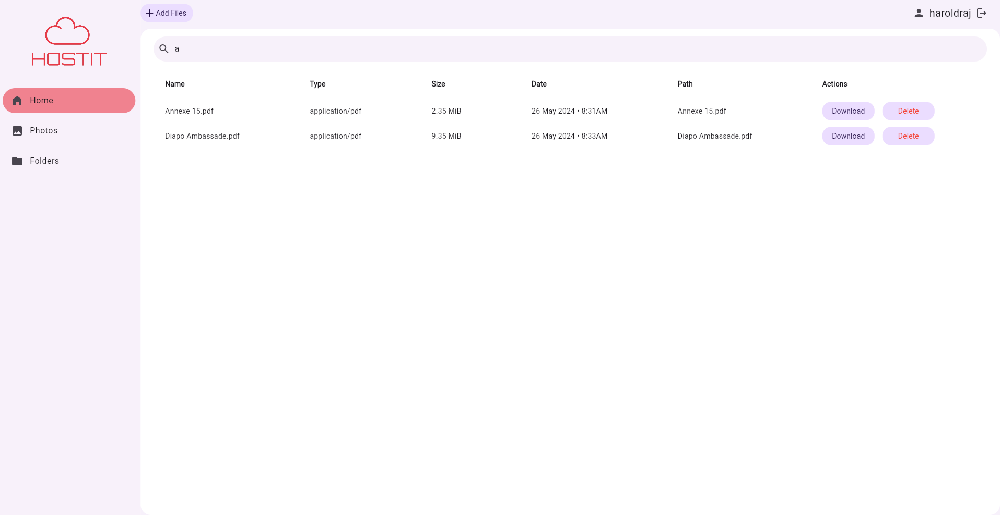
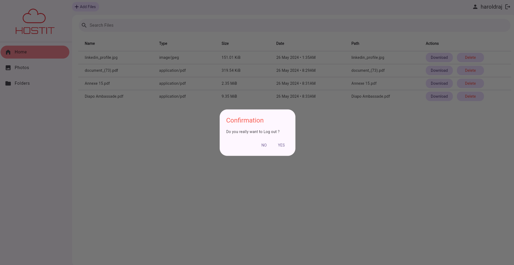

# Hostit
A storage solution cross-platform app

>**with Spring Boot & Flutter**

     

# Contributors
- Loique Darios
- Franck Patrick ESSI
- Harold Rajaonarison

## Introduction

This project aims to create a highly scalable and available cloud storage platform designed for non-technical users. The infrastructure consists of a Kubernetes cluster (K3s), a TrueNAS storage solution, MinIO for object storage, Spring Boot services, NGINX as a reverse proxy, and a Flutter frontend application.

# Features
- Authentication & registration
- Drag and drop  & filepicker to upload file
- Download file
- Fetch all files
- Search file by name
- View file in browser new tab
- Sort file list by column name (ascending and descending)

# Application

## Microservice architectures
Each service have his own database

